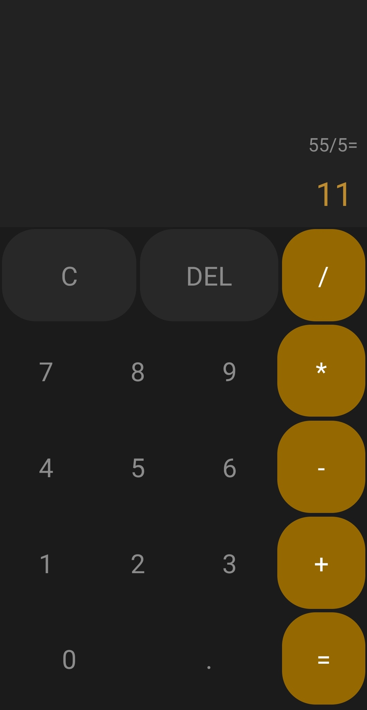
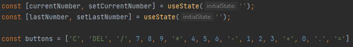
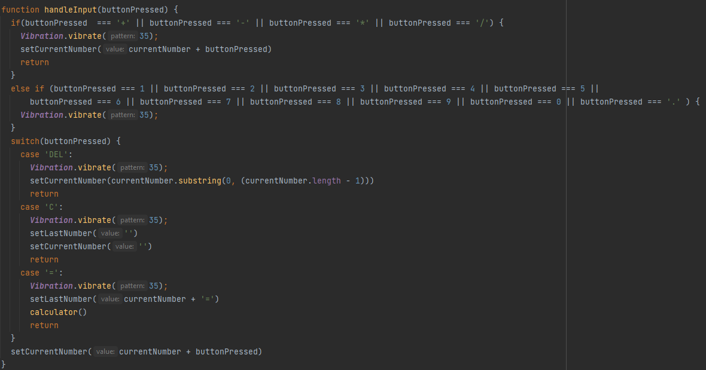
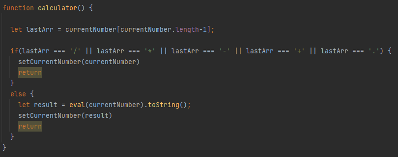
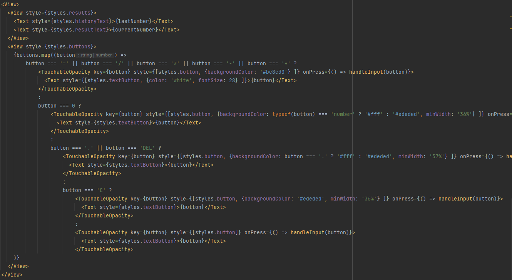

### Lab 1 - Kalkulator

Do wykonania zadania wykorzystałem [expo.dev](https://expo.dev) do budowy aplikacji i uruchomenia jej z poziomu własnego telefonu.

Aplikacja jest oparta na podstawie https://github.com/victorsalesdev/calculator

####Screen aplikacji z telefonu

####Opis

Wykorzystanie useState do obecnej i poprzedniej liczby wpisanej do kalkulatora, oraz przypisanie wszystkich znaków do zmiennej buttons.

Funkcja do obsługi wciśniętych guzików, czyli wprowadzenia liczb, wprowadzenia znaków operacji matematycznych, wyczyszczenia, lub usunięcia ostatniego znaku, a ostatecznie do podsumowania, gdzie wykorzystywana jest funkcja calculator.

Funkcja calculator która sprawdza jaki został użyty ostatni znak, jeśli jest to znak operacji przepisuje stringa, jeśli nie ma, wykorzystywany jest eval do obliczenia całej operacji.

Sam wygląd jak i układ guzików jest w pełni w View, gdzie wykorzystano TouchableOpacity. 

