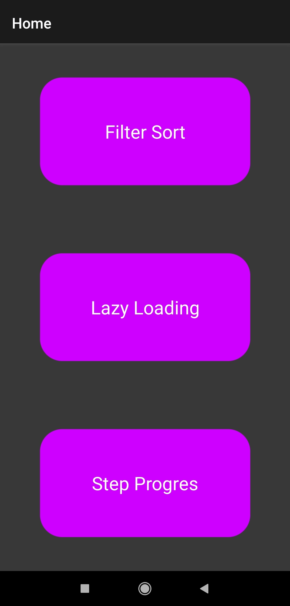
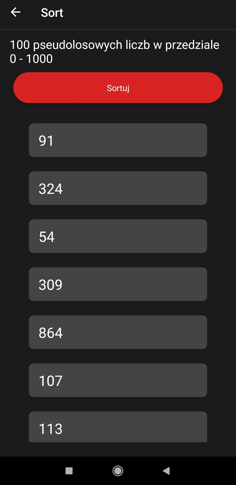
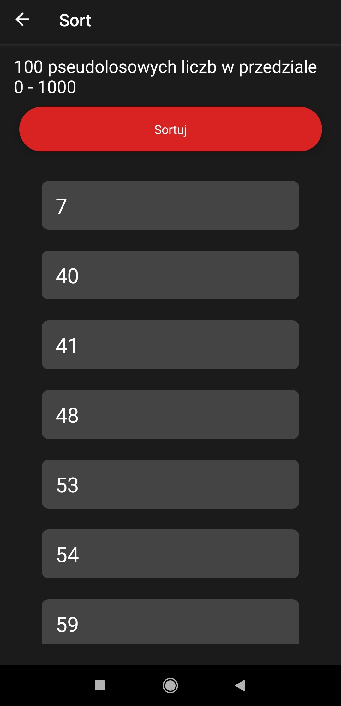
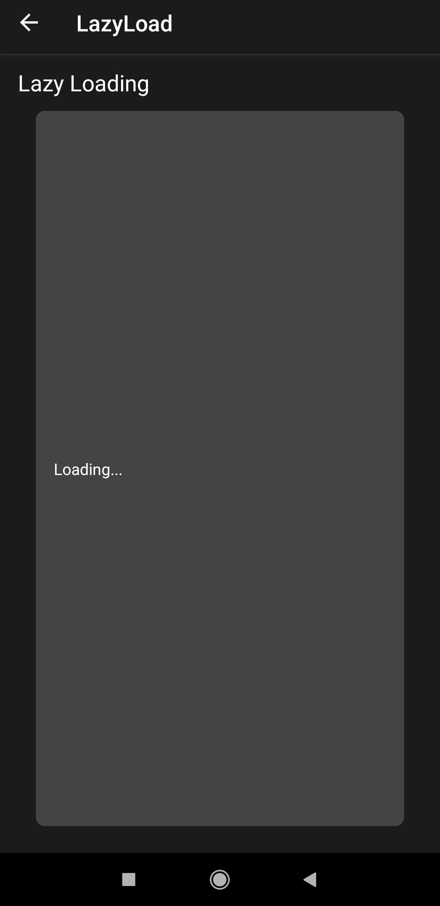
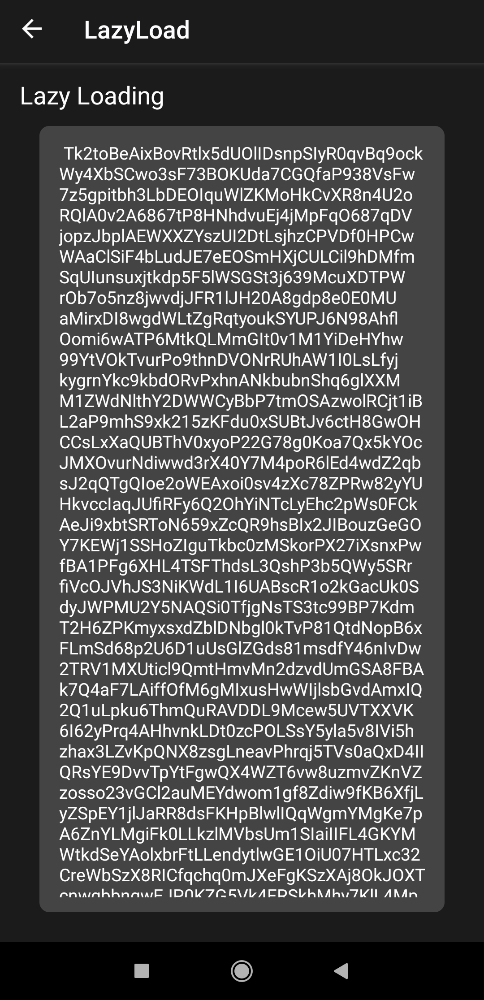
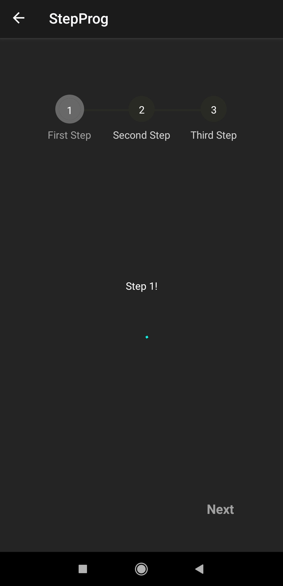
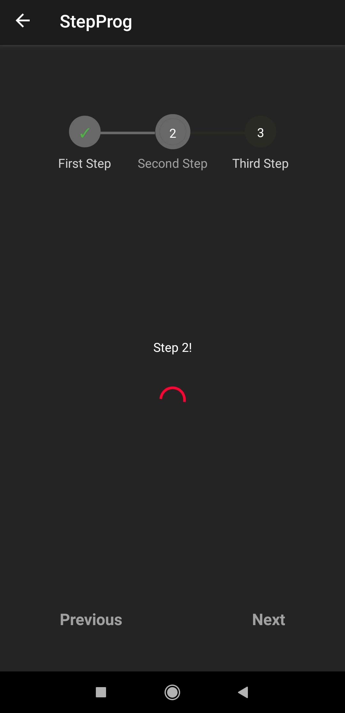
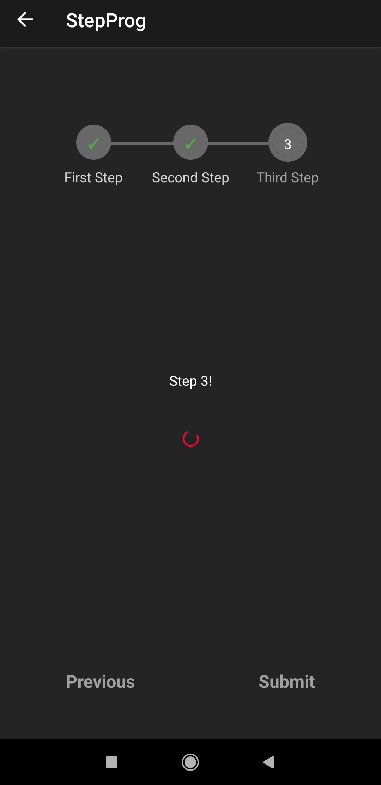

# Lab 3

Aplikacja oparta o lab2, utworzona za pomocą expo.dev, screeny aplikacji z telefonu na androidzie.

## Home.js

```js
export default function Home({navigation}) {
    return (
        <View style={style.home.View}>
            <TouchableOpacity style={style.home.Button} onPress={() => navigation.navigate('Sort')} >
                <Text style={style.home.Text}>Filter Sort</Text>
            </TouchableOpacity>
            <TouchableOpacity style={style.home.Button}   onPress={() => navigation.navigate('LazyLoad')} >
                <Text style={style.home.Text}>Lazy Loading</Text>
            </TouchableOpacity>
            <TouchableOpacity style={style.home.Button}  onPress={() => navigation.navigate('StepProg')} >
                <Text style={style.home.Text}>Step Progres</Text>
            </TouchableOpacity>
        </View>
    );
}
```
## Sort.js

Generowanie stu pseudolosowych liczb, a następnie sortowanie po wciśnięciu guzika.

Przed


Po


```js
const Lista = ({ tablica }) => {
    var i = 0
    return (
        <ScrollView >
            {tablica.map(liczba => <Text style = {style.sort.Example} key={i++} >{liczba}</Text>)}
        </ScrollView>
    );
};

export default class FilterSort extends Component {
    constructor() {
        super();
        const tab = [];

        for (let i = 0; i < 100; i++) {
            tab.push(Math.floor(Math.random() * 1000)+1);
        }

        this.state = { tab };
    }

    sortowanie = () =>{
        this.state.tab.sort((a,b) => a > b ? 1:-1)
        this.forceUpdate()
    }
    render(){
        return (
            <View style = {style.sort.View}>
                <Text style = {style.sort.Text}>100 pseudolosowych liczb w przedziale 0 - 1000</Text>
                <View style={style.sort.Buttons}>
                    <TouchableOpacity style={style.sort.Button} onPress={this.sortowanie}>
                        <Text >Sortuj</Text>
                    </TouchableOpacity>
                </View>
                <View  style = {style.sort.View} >
                    <Lista  tablica={this.state.tab} />
                </View>
            </View>

        );
    }
}
```
## LazyLoad.js oraz ToLoad.js

Do wykonania działającego lazy loading były potrzebne dwa komponenty, jeden do wygenerowania losowego tekstu o podanej długości, z puli znaków.
W drugim wykorzystujemy ten komponent, w metodzie lazy().





```js
export default class ComponentToLoad extends Component {
    constructor(props){
        super(props)

        const length = props.length ? props.length : 0

        const characters ='ABCDEFGHIJKLMNOPQRSTUVWXYZabcdefghijklmnopqrstuvwxyz0123456789';
        let load = ' ';
        const charactersLength = characters.length;
        for ( let i = 0; i < length; i++ ) {
            load += characters.charAt(Math.floor(Math.random() * charactersLength));
        }

        this.state = { text: load }
    }
    render(){
        return (
            <ScrollView>
                <Text>{this.state.text}</Text>
            </ScrollView>
        )
    };
}
```

```js
const Lazy = React.lazy(() => import('./ToLoad'))

export default class LazyLoading extends Component {
    render(){
        return (
            <View style = {style.lazy.View}>
                <Text style = {style.lazy.Text}>Lazy Loading</Text>
                <View style = {style.lazy.Example}>
                    <Suspense fallback={<Text>Loading...</Text>}>
                        <Lazy length="100000"/>
                    </Suspense>
                </View>
            </View>
        );
    }
}
```

## StepProg.js

Tutaj jest wykonywanie prokresu krokowego, do którego wykorzystano 'react-native-progress-steps'







```js
export default class FirstStepProgress extends Component {

    defaultScrollViewProps = {
        keyboardShouldPersistTaps: 'handled',
        contentContainerStyle: {
            flex: 1,
            justifyContent: 'center'
        }
    };

    onStepComplete = () => {
        alert('Koniec');
    };
    render(){
        const progressStepsStyle = {
            activeStepIconBorderColor: '#686868',
            activeLabelColor: '#686868',
            activeStepNumColor: 'white',
            activeStepIconColor: '#686868',
            completedStepIconColor: '#686868',
            completedProgressBarColor: '#686868',
            completedCheckColor: '#4bb543'
        };

        const buttonTextStyle = {
            color: '#686868',
            fontWeight: 'bold'
        };
        return (
            <View style={{flex: 1, marginTop: 50 }}>
                <ProgressSteps {...progressStepsStyle}>
                    <ProgressStep
                        label="First Step"
                        scrollViewProps={this.defaultScrollViewProps}
                        nextBtnTextStyle={buttonTextStyle}
                        previousBtnTextStyle={buttonTextStyle}
                    >
                        <View style={{ alignItems: 'center' }}>
                            <Text>Step 1!</Text>
                            <View style={[style.step.Container, style.step.Horizontal]}>

                                <ActivityIndicator size="large" color="#03fcf0" />
                            </View>

                        </View>
                    </ProgressStep>
                    <ProgressStep
                        label="Second Step"
                        scrollViewProps={this.defaultScrollViewProps}
                        nextBtnTextStyle={buttonTextStyle}
                        previousBtnTextStyle={buttonTextStyle}
                    >
                        <View style={{ alignItems: 'center' }}>
                            <Text>Step 2!</Text>
                            <View style={[style.step.Container, style.step.Horizontal]}>

                                <ActivityIndicator size="large" color="#fc0331" />
                            </View>
                        </View>
                    </ProgressStep>
                    <ProgressStep
                        label="Third Step"
                        FinishBtnText={'Zakończ'}
                        onSubmit={this.onStepComplete}
                        scrollViewProps={this.defaultScrollViewProps}
                        nextBtnTextStyle={buttonTextStyle}
                        previousBtnTextStyle={buttonTextStyle}
                    >
                        <View style={{ alignItems: 'center' }}>
                            <Text>Step 3!</Text>
                            <View style={[style.step.Container, style.step.Horizontal]}>

                                <ActivityIndicator size="small" color="#fc0331" />
                            </View>
                        </View>
                    </ProgressStep>
                </ProgressSteps>
            </View>
        );
    }
}
```