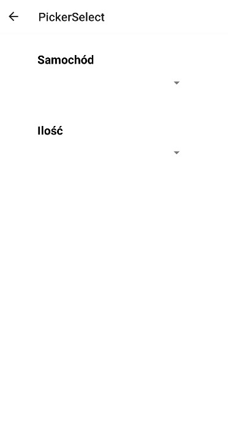
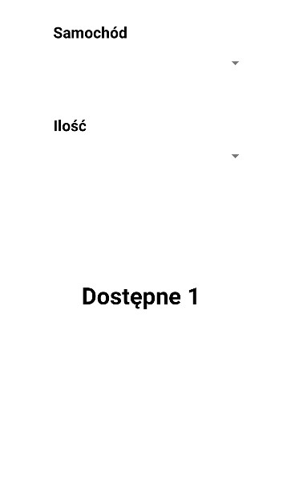

# Lab 4

Aplikacja oparta o lab2, utworzona za pomocą expo.dev, screeny aplikacji z android studio.

## Home

````js
export default function Home({navigation}) {
    return (
      <View style={styles.home.homeContainer}>
        <TouchableOpacity style={styles.home.homeButton}  onPress={() => navigation.navigate('TextInput')} >
          <Text style={styles.home.homeText}>Text Input</Text>
        </TouchableOpacity>
        <TouchableOpacity style={styles.home.homeButton}  onPress={() => navigation.navigate('PickerSelect')} >
          <Text style={styles.home.homeText}>Picker Select</Text>
        </TouchableOpacity>
        <TouchableOpacity style={styles.home.homeButton} onPress={() => navigation.navigate('SwitchScr')} >
          <Text style={styles.home.homeText}>Switch</Text>
        </TouchableOpacity>
        <TouchableOpacity style={styles.home.homeButton} onPress={() => navigation.navigate('ToastScr')} >
          <Text style={styles.home.homeText}>Toast</Text>
        </TouchableOpacity>
        <TouchableOpacity style={styles.home.homeButton} onPress={() => navigation.navigate('DatePicker')} >
          <Text style={styles.home.homeText}>DatePicker</Text>
        </TouchableOpacity>
        
      </View>
    );
  }
````


## Text Input

````js
export default class FilterSort extends Component {
    render(){
        return (
          <View style={styles.TextInput.homeContainer}>
            <View style={styles.TextInput.title}>
                <Text style={styles.TextInput.titleText}>TextInput</Text>
            </View>
            <ScrollView >
                    <View>
                        <Text style={styles.TextInput.text}>Default TextInput</Text>
                        <TextInput style={styles.TextInput.input} /><Text/>
                    </View>
                    <View>
                        <Text style={styles.TextInput.text} >TextInput z placeholder'em</Text>
                        <TextInput style={styles.TextInput.input} placeholder="Placeholder" /><Text/>
                    </View>
                    <View>
                        <Text style={styles.TextInput.text}>TextInput z ustawioną wartością której nie można zmienić</Text>
                        <TextInput style={styles.TextInput.input} value="Ustawiona wartość" /><Text/>
                    </View>
                    <View>
                        <Text style={styles.TextInput.text}>TextInput z wartością domyślną i autoCorrect</Text>
                        <TextInput style={styles.TextInput.input} defaultValue="Domyślna wartość" autoCorrect={true}/><Text/>
                    </View>
                    <View>
                        <Text style={styles.TextInput.text}>TextInput z limitem długośći (50) i multiline</Text>
                        <TextInput style={styles.TextInput.input} maxLength={50} multiline={true} /><Text/>
                    </View>
                    <View>
                        <Text style={styles.TextInput.text}>TextInput z klawiaturą numeryczną z secureTextEntry</Text>
                        <TextInput style={styles.TextInput.input} keyboardType="numeric" secureTextEntry/><Text/>
                    </View>
                    <View>
                        <Text style={styles.TextInput.text}>TextInput zablokowany z domyślną wartością</Text>
                        <TextInput style={styles.TextInput.input} editable={false} defaultValue="Zablokowany"/><Text/>
                    </View>
                    <View>
                        <Text style={styles.TextInput.text}>TextInput z metodą która wyświetla alert po zmianie</Text>
                        <TextInput style={styles.TextInput.input} onChange={event =>{alert(event.nativeEvent.text)}}/><Text/>
                    </View>
            </ScrollView>
          </View>
          
        );
      }
  }
````


## Picker Select

````js
export default function PickerSelect() {
    const [items, setItems] = useState([
        { label: "", value: "" },
        { label: "BMW E36", value: "BMW E36" },
        { label: "BMW E38", value: "BMW E38" },
        { label: "BMW E39", value: "BMW E39" },
        { label: "BMW E46", value: "BMW E46" }
        ]);
    const [number, setNumber] = useState([
        { label: "", value: null, element: ["BMW E36", "BMW E36", "BMW E36", "BMW E36"] },
        { label: "1", value: 1, element: ["BMW E36", "BMW E39"] },
        { label: "3", value: 2, element: ["BMW E36", "BMW E38"] },
        { label: "2", value: 4, element: ["BMW E38"] },
        { label: "2", value: 4, element: ["BMW E46"] }
        ]);
    const [availableNumber, setAvailableNumber] = useState([]);
    const [selectedNumber, setSelectedNumber] = useState(null);
    const [selectedItem, setSelectedItem] = useState(null);
    const [selection, setSelection] = useState("");
    return (
        <View style={styles.PickerSelect.container}>
            <View style={styles.PickerSelect.pickerContainer}>
                <View style={styles.PickerSelect.selectContainer}>
                    <Select
                        label="Samochód"
                        items={items}
                        selectedValue={selectedItem}
                        onValueChange={it => {
                            setSelectedItem(it);
                            setSelectedNumber(null);
                            setAvailableNumber(number.filter(i =>
                                i.element.includes(it)));
                        }}
                    />
                </View>
                <View style={styles.PickerSelect.selectContainer}>
                    <Select
                        label="Ilość"
                        items={availableNumber}
                        selectedValue={selectedNumber}
                        onValueChange={numb => {
                            setSelectedItem(numb);
                            setSelection(
                                ` Dostępne ${number.find(i => i.value ===
                                    numb).label}`
                        );
                    }}
                    />
                </View>
            </View>
            <View style={styles.PickerSelect.selectionContainer}>
                <Text style={styles.PickerSelect.selection}>{selection}</Text>
            </View>
        </View>
        );
   }
````




## Switch

````js
export default class SwitchScr extends Component {state = {
    modalVisible: false
  };

  setModalVisible = (visible) => {
    this.setState({ modalVisible: visible });
  }

  render() {
    const { modalVisible } = this.state;
    return (
      <View style={styles.SwitchScr.centeredView}>
        <Modal
          animationType="slide"
          transparent={true}
          visible={modalVisible}
          onRequestClose={() => {
            this.setModalVisible(!modalVisible);
          }}
        >
          <View style={styles.SwitchScr.centeredView}>
            <View style={styles.SwitchScr.modalView}>
              <Text style={styles.SwitchScr.modalText}>{Math.floor(Math.random()*100)}</Text>
              <Pressable
                style={styles.SwitchScr.button}
                onPress={() => this.setModalVisible(!modalVisible)}
              >
                <Text style={styles.SwitchScr.textStyle}>Schowaj</Text>
              </Pressable>
            </View>
          </View>
        </Modal>
        <Text style={styles.SwitchScr.textStyle}>Pokaż pseudolosową liczbę z przedziału 0-100</Text>
        <Switch value={modalVisible} onValueChange={() => this.setModalVisible(true)}/>
      </View>
    );
  }
}
````


## Toast

````js
const Toast = ({ visible}) => {
  if (visible) {
    ToastAndroid.showWithGravityAndOffset(
      "Toast",
      ToastAndroid.LONG,
      ToastAndroid.CENTER,
      25,
      50
    );
  }
  return null;
};

const ToastButton = () => {
  const [visible, setvisible] = React.useState(false);
  const [switchOn, setswitchOn] = React.useState(false);
  const [time, setTime] = useState(0);

  useEffect(() => setvisible(false), [visible]);

  const handleButtonPress = () => {
    setvisible(true);
  };

  const onToggleSwitch = () => {
    setswitchOn(!switchOn);
  };


  var promise = null
  const createPromise = () => {
      let time = Math.floor(Math.random()*10000)
      setTime(time)
      promise = new Promise((resolve, reject) => {
          setTimeout(() => {
              resolve('ukryj');
          }, time);
      });
  }

  return (
      <View style={styles.Toast.modalContainer}>
          <Toast visible={visible} />
          <Button title="Toast i Modal" onPress={() => {
              onToggleSwitch()
              handleButtonPress()
              createPromise()
              promise.then((value) => {
                  if(value == 'ukryj'){
                      setswitchOn(false)
                  }
              });
          }}/>
          <Modal
              animationType="fade"
              transparent={false}
              visible={switchOn}
              onRequestClose={() => {
                  setModalVisible(!switchOn);
              }}
          >
              <View >
                  <View >
                      <Text onPress={onToggleSwitch} style={styles.Toast.modalText}>Modal wyłączy się za:</Text>
                      <Text style={styles.Toast.modalText}>{time/1000} s</Text>
                  </View>
              </View>
          </Modal> 
      </View>
  );
};


export default class ToastScr extends Component {
    render(){
        return (
          <View style={styles.Toast.container}>
            <ScrollView >
                <ToastButton/><Text/>
                <Text style={[styles.Toast.text,{fontWeight: "bold",}]}>Po kliknieciu w przycisk pojawi się ToastAndroid oraz Modal. </Text>
                <Text style={styles.Toast.text}>W modalu zostanie wyświetlony czas w sekundach po którym zostanie on zamknięty.</Text>
                <Text style={styles.Toast.text}>Modal zostanie zamkniety po otrzymianiu z Promise wartości 'ukryj'</Text>
            </ScrollView>
          </View>
          
        );
      }
  }
  
  ````


## DatePicker

````js
export default class TextInput extends Component {


    constructor(props) {
        super(props);
        this.state = {
            isDateTimePickerVisible: false,
            pickedDate: ""
        };
    }
    showDateTimePicker = () => {
        this.setState({ isDateTimePickerVisible: true});
    };

    hideDateTimePicker = (datetime) => {
        this.setState({ isDateTimePickerVisible: false});
    };

    handleDatePicked = date => {
        console.log("A date has been picked: ", date);
        const mdate = date.toString().split(" ");
        this.setState({
            pickedDate: mdate[1] + " " + mdate[2] + ", " + mdate[3]
        });
        this.hideDateTimePicker();
    };

    render(){
        return (
          <View style = {styles.DatePicker.homeContainer}>
              <View style = {styles.DatePicker.textContainer}>
                <Text style = {styles.DatePicker.text}>
                    {this.state.pickedDate}
                </Text>
              </View>
              <View style = {styles.DatePicker.homeContainer}>
                <Button style = {styles.DatePicker.button} title="Wybierz datę i godzinę" onPress={this.showDateTimePicker} />
                <DateTimePickerModal
                    isVisible={this.state.isDateTimePickerVisible}
                    mode={"datetime"}
                    onConfirm={this.handleDatePicked}
                    onCancel={this.hideDateTimePicker}
                    is24Hour={false}
                />
            </View>
          </View>

        );
      }
  }
````


