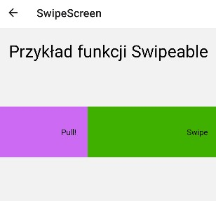

# Lab 5

Aplikacja oparta o lab2, utworzona za pomocą expo.dev, screeny aplikacji z android studio.

### Home


````js
export default function Home({navigation}) {
    return (
      <View style={styles.home.homeContainer}>
        <TouchableOpacity style={styles.home.homeButton}  onPress={() => navigation.navigate('FirstScroll')} >
          <Text style={styles.home.homeText}>First Scroll</Text>
        </TouchableOpacity>
        <TouchableOpacity style={styles.home.homeButton}  onPress={() => navigation.navigate('SecondScroll')} >
          <Text style={styles.home.homeText}>Second Scroll</Text>
        </TouchableOpacity>
        <TouchableOpacity style={styles.home.homeButton} onPress={() => navigation.navigate('SwipeScreen')} >
          <Text style={styles.home.homeText}>Swipe Screen</Text>
        </TouchableOpacity>
        <TouchableOpacity style={styles.home.homeButton} onPress={() => navigation.navigate('TouchableScreen')} >
          <Text style={styles.home.homeText}>Touchable Screen</Text>
        </TouchableOpacity> 
      </View>
    );
  }
````
### Scroll


````js
export default class FirstScroll extends Component {
    render(){
        return (
          <View >
                <ScrollView contentContainerStyle={styles.firstScreen.scrollView}>
                    <View style={[styles.firstScreen.viewBox, { backgroundColor: "#99c09d" }]}/>
                    <View style={[styles.firstScreen.viewBox, { backgroundColor: "orange" }]}/>
                    <View style={[styles.firstScreen.viewBox, { backgroundColor: "red" }]}/>
                    <View style={[styles.firstScreen.viewBox, { backgroundColor: "#00c000" }]}/>
                    <View style={[styles.firstScreen.viewBox, { backgroundColor: "#96ceb4" }]}/>
                    <View style={[styles.firstScreen.viewBox, { backgroundColor: "yellow" }]}/>
                    <View style={[styles.firstScreen.viewBox, { backgroundColor: "green" }]}/>
                    <View style={[styles.firstScreen.viewBox, { backgroundColor: "purple" }]}/>
                    <View style={[styles.firstScreen.viewBox, { backgroundColor: "#ff9636" }]}/>
                    <View style={[styles.firstScreen.viewBox, { backgroundColor: "#000080" }]}/>   
                </ScrollView>
          </View>
          
        );
      }
  }
  ````

### Scroll


```js
export default class SecondScroll extends Component {
    render(){
        return (
          <View >
                <ScrollView contentContainerStyle={styles.secondScreen.scrollView}>
                    <View style={[styles.secondScreen.viewBox, { backgroundColor: "#99c09d" }]}/>
                    <View style={[styles.secondScreen.viewBox, { backgroundColor: "orange" }]}/>
                    <View style={[styles.secondScreen.viewBox, { backgroundColor: "red" }]}/>
                    <View style={[styles.secondScreen.viewBox, { backgroundColor: "#00c000" }]}/>
                    <View style={[styles.secondScreen.viewBox, { backgroundColor: "#96ceb4" }]}/>
                    <View style={[styles.secondScreen.viewBox, { backgroundColor: "yellow" }]}/>
                    <View style={[styles.secondScreen.viewBox, { backgroundColor: "green" }]}/>
                    <View style={[styles.secondScreen.viewBox, { backgroundColor: "purple" }]}/>
                    <View style={[styles.secondScreen.viewBox, { backgroundColor: "#ff9636" }]}/>
                    <View style={[styles.secondScreen.viewBox, { backgroundColor: "#000080" }]}/>   
                </ScrollView>
          </View>
          
        );
      }
  }
```

### Swipe

Po przeciągnięciu pojawia się pasek który informuje żeby albo przeciągać, kiedy dojedzie do maksimum, wyskoczy informacja o puszczeniu, po czym zmieni się kolor głównego paska z napisem Swipe.





```js
class Swipe extends Component {

  state = {
    leftAction: false,
    toggle: false
  };

  render() {
    const {leftAction, toggle} = this.state;

    return (
      <Swipeable
        leftActionActivationDistance={200}
        leftContent={(
          <View style={[styles.swipeScreen.leftSwipeItem, {backgroundColor: leftAction ? '#75617c' : '#cd6af3'}]}>
            {leftAction ?
              <Text>Drop!</Text> :
              <Text>Pull!</Text>}
          </View>
        )}
        onLeftActionActivate={() => this.setState({leftAction: true})}
        onLeftActionDeactivate={() => this.setState({leftAction: false})}
        onLeftActionComplete={() => this.setState({toggle: !toggle})}
      >
        <View style={[styles.swipeScreen.listItem, {backgroundColor: toggle ? '#d92222' : '#40b000'}]}>
          <Text>Swipe</Text>
        </View>
      </Swipeable>
    );
  }
}

export default class  SwipeScreen extends Component{
  
  state = {
    currentSwipeable: null
  };

  handleScroll = () => {
    const {currentSwipeable} = this.state;

    if (currentSwipeable) {
      currentSwipeable.recenter();
    }
  };

  render() {
    const {currentSwipeable} = this.state;
    const itemProps = {
      onOpen: (event, gestureState, swipeable) => {
        if (currentSwipeable && currentSwipeable !== swipeable) {
          currentSwipeable.recenter();
        }

        this.setState({currentSwipeable: swipeable});
      },
      onClose: () => this.setState({currentSwipeable: null})
    };

    return (
      <ScrollView>
        <Text style={styles.swipeScreen.text}>Przykład funkcji Swipeable</Text>
        <ScrollView onScroll={this.handleScroll} style={styles.swipeScreen.container}>
          <Swipe {...itemProps} />
        </ScrollView>
      </ScrollView>
    );
  }
}
```

### Touchable Opacity i Highlight

Widoczne różnice po przytrzymaniu guzików, po kliknieciu nalicza kliknięcia.


```js
export default class TouchableScreen extends Component {
        constructor(props) {
          super(props);
          this.state = { 
              countTouchableOpacity : 0,
              countTouchableHighlight : 0,
          };
      }

      onPressTouchableOpacity = () => {
          this.setState({
              countTouchableOpacity: this.state.countTouchableOpacity + 1
          });
      };
      onPressTouchableHighlight = () => {
          this.setState({
              countTouchableHighlight: this.state.countTouchableHighlight + 1
          });
      };

      render(){ 
          return (
              <View style={[styles.touchableScreen.container]}>
                  <ScrollView >
                      <View style={[styles.touchableScreen.firstContainer]}>
                          <View >
                              <View >
                                  <TouchableOpacity
                                      style={[styles.touchableScreen.button]}
                                      onPress={this.onPressTouchableOpacity}
                                  >
                                      <Text style={[styles.touchableScreen.textButton]}>TouchableOpacity</Text>
                                  </TouchableOpacity>
                              </View>
                              <View >
                                  <Text style={[styles.touchableScreen.text]} >{`Kliknięcia`}: </Text><Text style={[styles.touchableScreen.text]}> {this.state.countTouchableOpacity}</Text>
                              </View>
                          </View>
                      </View>
                      <View style={[styles.touchableScreen.secondContainer]}>
                          <View >
                              <View >
                                  <TouchableHighlight
                                      style={[styles.touchableScreen.button]}
                                      onPress={this.onPressTouchableHighlight}
                                  >
                                      <Text style={[styles.touchableScreen.textButton]}>TouchableHighlight</Text>
                                  </TouchableHighlight>
                              </View>
                              <View >
                                  <Text style={[styles.touchableScreen.text]}>{`Kliknięcia`}: </Text><Text style={[styles.touchableScreen.text]}> {this.state.countTouchableHighlight}</Text>
                              </View>
                          </View>
                      </View>
                  </ScrollView>
              </View>
          )
      };
  }
```

