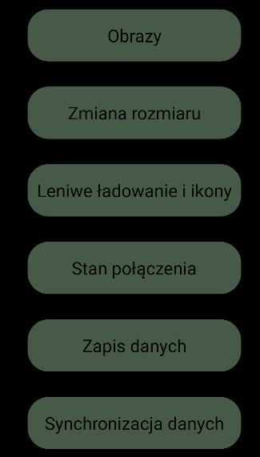
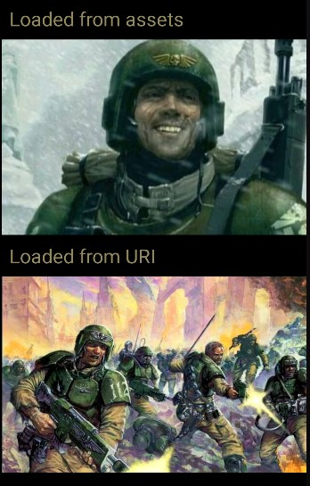
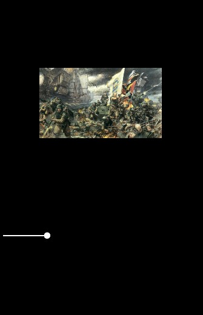
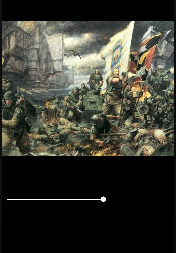
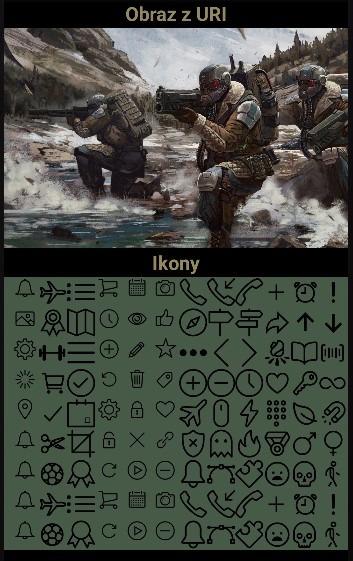
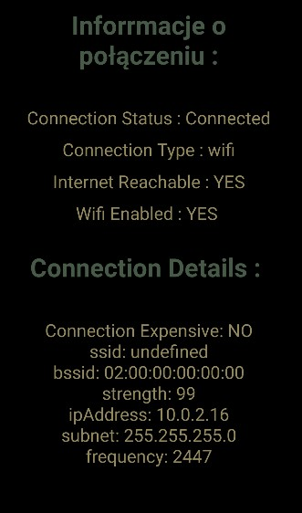
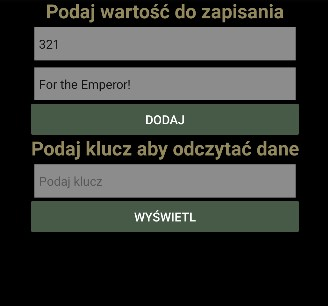
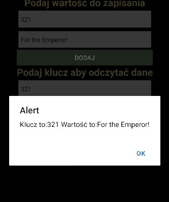
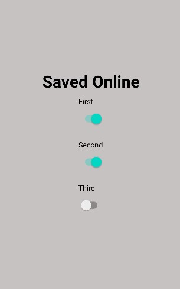
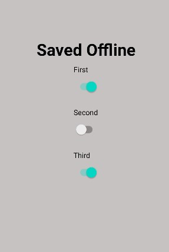

# Lab 6 

Aplikacja oparta o lab2, utworzona za pomocą expo.dev, screeny aplikacji z android studio.

## Ekran startowy


```js
export default function Home({navigation}) {
    return (
      <View style={styles.home.homeContainer}>
        <TouchableOpacity style={styles.home.homeButton}  onPress={() => navigation.navigate('ImageScreen')} >
          <Text style={styles.home.homeText}>Obrazy</Text>
        </TouchableOpacity>
        <TouchableOpacity style={styles.home.homeButton}  onPress={() => navigation.navigate('ResizeImageScreen')} >
          <Text style={styles.home.homeText}>Zmiana rozmiaru</Text>
        </TouchableOpacity>
        <TouchableOpacity style={styles.home.homeButton} onPress={() => navigation.navigate('LazyIconsScreen')} >
          <Text style={styles.home.homeText}>Leniwe ładowanie i ikony</Text>
        </TouchableOpacity>
        <TouchableOpacity style={styles.home.homeButton} onPress={() => navigation.navigate('ConnectionScreen')} >
          <Text style={styles.home.homeText}>Stan połączenia</Text>
        </TouchableOpacity>
        <TouchableOpacity style={styles.home.homeButton} onPress={() => navigation.navigate('AsyncStorageScreen')} >
          <Text style={styles.home.homeText}>Zapis danych</Text>
        </TouchableOpacity>
        <TouchableOpacity style={styles.home.homeButton} onPress={() => navigation.navigate('SyncScreen')} >
          <Text style={styles.home.homeText}>Synchronizacja danych</Text>
        </TouchableOpacity>
        
      </View>
    );
  }
```

## Obrazki

W prosty sposób pobieramy obrazek z pliku, który znajduje się w folderze assets, oraz za pomocą URI




```js
import img from '../assets/happy-guard.jpg';

export default class ImageScreen extends Component {
    render(){
        return (
            <View style={styles.imageScreen.body}>

                <Text style={styles.imageScreen.text}>Loaded from assets</Text>
                <Image style={styles.screen.image} source={img}/>

                <Text style={styles.imageScreen.text}>Loaded from URI</Text>
                <Image
                    source={{uri: "https://static.wikia.nocookie.net/warhammer40k/images/9/9a/Img001.jpg/revision/latest?cb=20120923073030"}}
                    style={styles.screen.image}/>

            </View>
          
        );
      }
  }
```

## Zmiana rozmiaru obrazka

Za pomocą suwaka, możemy zmieniać rozmiar obrazka na ekranie.






```js
export default class ResizeImageScreen extends Component {
    state = {
      firstImageScale: 1
    }
    resizeFirstImage = (value) => {
        this.setState({firstImageScale: value});
    }

    render(){
        return (
          <View style ={styles.resizableScreen.container}>
                <View style ={styles.resizableScreen.center}>
                    <Image  source={{ uri: "https://i.pinimg.com/originals/51/3f/79/513f79e98c5c21aa2afbdedd0f8ca345.jpg" }} style={[styles.screen.image, {transform: [{ scale: this.state.firstImageScale }]}]} />
                    <Slider
                        style={{width: 400, height: 250}}
                        value={1}
                        minimumValue={0.1}
                        maximumValue={2}
                        thumbTintColor='#FFFFFF'
                        minimumTrackTintColor="#FFFFFF"
                        maximumTrackTintColor="#000000"
                        onValueChange={this.resizeFirstImage}
                    />
            </View>
          </View>
          
        );
      }
  }
```

## Lazy load oraz ikony

Po przejściu do zakładki trzeba chwilę odczekać zanim pojawią się ikony, obraz pojawia się prawie natychmiast.




```js
export default class LazyIconsScreen extends Component {
    render(){
        return (
          <View style = {styles.lazyscreen.body}>
                <ScrollView contentContainerStyle ={{display:'flex',flexDirection:'column',width:'100%'}}>
                    <View >
                        <View>
                            <Text style = {styles.lazyscreen.text}>Obraz z URI</Text>
                            <Image style = {styles.screen.image}  source={{ uri: "https://i.redd.it/g2yvt5ihckz41.jpg" }}  progressiveRenderingEnabled={false}/>
                        </View>
                    </View> 
                    <View style ={{width:'100%'}}>
                        <Text style = {styles.lazyscreen.text}>Ikony</Text>    
                        <View style = {styles.lazyscreen.icons}>
                            <EvilIcons name="bell" size={32} color="black" />
                            <Ionicons name="airplane-outline" size={32} color="black" />
                            <SimpleLineIcons name="list" size={32} color="black" />
                            <EvilIcons name="cart" size={32} color="black" />
                            <EvilIcons name="calendar" size={32} color="black" />
                            <EvilIcons name="camera" size={32} color="black" />
                            <SimpleLineIcons name="phone" size={32} color="black" />
                            <SimpleLineIcons name="call-in" size={32} color="black" />
                            <SimpleLineIcons name="call-end" size={32} color="black" />
                            <Ionicons name="add-outline" size={32} color="black" />
                            <Ionicons name="alarm-outline" size={32} color="black" />
                            <Ionicons name="alert-outline" size={32} color="black" />
                        </View>
                        <View style = {styles.lazyscreen.icons}>
                            <EvilIcons name="image" size={32} color="black" />
                            <Ionicons name="ribbon-outline" size={32} color="black" />
                            <SimpleLineIcons name="map" size={32} color="black" />
                            <EvilIcons name="clock" size={32} color="black" />
                            <EvilIcons name="eye" size={32} color="black" />
                            <EvilIcons name="like" size={32} color="black" />
                            <SimpleLineIcons name="compass" size={32} color="black" />
                            <SimpleLineIcons name="direction" size={32} color="black" />
                            <SimpleLineIcons name="directions" size={32} color="black" />
                            <Ionicons name="arrow-redo-outline" size={32} color="black" />
                            <Ionicons name="arrow-up-outline" size={32} color="black" />
                            <Ionicons name="arrow-down-outline" size={32} color="black" />
                        </View>
                        <View style = {styles.lazyscreen.icons}>
                            <EvilIcons name="gear" size={32} color="black" />
                            <Ionicons name="barbell-outline" size={32} color="black" />
                            <SimpleLineIcons name="menu" size={32} color="black" />
                            <EvilIcons name="plus" size={32} color="black" />
                            <EvilIcons name="pencil" size={32} color="black" />
                            <EvilIcons name="star" size={32} color="black" />
                            <SimpleLineIcons name="options" size={32} color="black" />
                            <SimpleLineIcons name="arrow-left" size={32} color="black" />
                            <SimpleLineIcons name="arrow-right" size={32} color="black" />
                            <Ionicons name="bonfire-outline" size={32} color="black" />
                            <Ionicons name="book-outline" size={32} color="black" />
                            <Ionicons name="barcode-outline" size={32} color="black" />
                        </View>
                        <View style = {styles.lazyscreen.icons}>
                            <EvilIcons name="spinner" size={32} color="black" />
                            <Ionicons name="cart-outline" size={32} color="black" />
                            <SimpleLineIcons name="check" size={32} color="black" />
                            <EvilIcons name="undo" size={32} color="black" />
                            <EvilIcons name="trash" size={32} color="black" />
                            <EvilIcons name="tag" size={32} color="black" />
                            <SimpleLineIcons name="plus" size={32} color="black" />
                            <SimpleLineIcons name="minus" size={32} color="black" />
                            <SimpleLineIcons name="clock" size={32} color="black" />
                            <Ionicons name="heart-outline" size={32} color="black" />
                            <Ionicons name="key-outline" size={32} color="black" />
                            <Ionicons name="infinite-outline" size={32} color="black" />
                        </View>
                        <View style = {styles.lazyscreen.icons}>
                            <EvilIcons name="location" size={32} color="black" />
                            <Ionicons name="checkmark-outline" size={32} color="black" />
                            <SimpleLineIcons name="event" size={32} color="black" />
                            <EvilIcons name="gear" size={32} color="black" />
                            <EvilIcons name="lock" size={32} color="black" />
                            <EvilIcons name="heart" size={32} color="black" />
                            <SimpleLineIcons name="plane" size={32} color="black" />
                            <SimpleLineIcons name="mouse" size={32} color="black" />
                            <SimpleLineIcons name="energy" size={32} color="black" />
                            <Ionicons name="keypad-outline" size={32} color="black" />
                            <Ionicons name="leaf-outline" size={32} color="black" />
                            <Ionicons name="magnet-outline" size={32} color="black" />
                        </View>
                        <View style = {styles.lazyscreen.icons}>
                            <EvilIcons name="bell" size={32} color="black" />
                            <Ionicons name="cut-outline" size={32} color="black" />
                            <SimpleLineIcons name="crop" size={32} color="black" />
                            <EvilIcons name="unlock" size={32} color="black" />
                            <EvilIcons name="close" size={32} color="black" />
                            <EvilIcons name="link" size={32} color="black" />
                            <SimpleLineIcons name="shield" size={32} color="black" />
                            <SimpleLineIcons name="ghost" size={32} color="black" />
                            <SimpleLineIcons name="fire" size={32} color="black" />
                            <Ionicons name="medal-outline" size={32} color="black" />
                            <Ionicons name="male-outline" size={32} color="black" />
                            <Ionicons name="female-outline" size={32} color="black" />
                        </View>
                        <View style = {styles.lazyscreen.icons}>
                            <EvilIcons name="bell" size={32} color="black" />
                            <Ionicons name="football-outline" size={32} color="black" />
                            <SimpleLineIcons name="badge" size={32} color="black" />
                            <EvilIcons name="redo" size={32} color="black" />
                            <EvilIcons name="play" size={32} color="black" />
                            <EvilIcons name="minus" size={32} color="black" />
                            <SimpleLineIcons name="bell" size={32} color="black" />
                            <SimpleLineIcons name="vector" size={32} color="black" />
                            <SimpleLineIcons name="puzzle" size={32} color="black" />
                            <Ionicons name="sad-outline" size={32} color="black" />
                            <Ionicons name="skull-outline" size={32} color="black" />
                            <Ionicons name="walk-outline" size={32} color="black" />
                        </View>
                        <View style = {styles.lazyscreen.icons}>
                            <EvilIcons name="bell" size={32} color="black" />
                            <Ionicons name="airplane-outline" size={32} color="black" />
                            <SimpleLineIcons name="list" size={32} color="black" />
                            <EvilIcons name="cart" size={32} color="black" />
                            <EvilIcons name="calendar" size={32} color="black" />
                            <EvilIcons name="camera" size={32} color="black" />
                            <SimpleLineIcons name="phone" size={32} color="black" />
                            <SimpleLineIcons name="call-in" size={32} color="black" />
                            <SimpleLineIcons name="call-end" size={32} color="black" />
                            <Ionicons name="add-outline" size={32} color="black" />
                            <Ionicons name="alarm-outline" size={32} color="black" />
                            <Ionicons name="alert-outline" size={32} color="black" />
                        </View>
                        <View style = {styles.lazyscreen.icons}>
                            <EvilIcons name="bell" size={32} color="black" />
                            <Ionicons name="football-outline" size={32} color="black" />
                            <SimpleLineIcons name="badge" size={32} color="black" />
                            <EvilIcons name="redo" size={32} color="black" />
                            <EvilIcons name="play" size={32} color="black" />
                            <EvilIcons name="minus" size={32} color="black" />
                            <SimpleLineIcons name="bell" size={32} color="black" />
                            <SimpleLineIcons name="vector" size={32} color="black" />
                            <SimpleLineIcons name="puzzle" size={32} color="black" />
                            <Ionicons name="sad-outline" size={32} color="black" />
                            <Ionicons name="skull-outline" size={32} color="black" />
                            <Ionicons name="walk-outline" size={32} color="black" />
                        </View>
                    </View>
                </ScrollView>
          </View>
          
        );
      }
  }
```

## Informacje o połaczaniu

Wyświetla inforamcje dotyczące połoczęnia urządzenia z siecią.



```js
export default class ConnectionScreen extends Component {
  NetInfoSubscribtion = null;

  constructor(props) {
    super(props);
    this.state = {
      connection_status: false,
      connection_type: null,
      connection_net_reachable: false,
      connection_wifi_enabled: false,
      connection_details: null,
    }
  }

  componentDidMount() {

    this.NetInfoSubscribtion = NetInfo.addEventListener(
      this._handleConnectivityChange,
    );

  }

  componentWillUnmount() {
    this.NetInfoSubscribtion && this.NetInfoSubscribtion();
  }

  _handleConnectivityChange = (state) => {
    this.setState({
      connection_status: state.isConnected,
      connection_type: state.type,
      connection_net_reachable: state.isInternetReachable,
      connection_wifi_enabled: state.isWifiEnabled,
      connection_details: state.details,
    })
  }
    render(){
        return (
          <View style={styles.connectionScrreen.body}>
        <Text style={styles.connectionScrreen.title}>
            Inforrmacje o połączeniu :{'\n'}
        </Text>
        <Text style={styles.connectionScrreen.detail}>
          Connection Status : {this.state.connection_status ? 'Connected' : 'Disconnected'}
        </Text>
        
        <Text style={styles.connectionScrreen.detail}>
          Connection Type : {this.state.connection_type}
        </Text>
        <Text style={styles.connectionScrreen.detail}>
          Internet Reachable : {this.state.connection_net_reachable ? 'YES' : 'NO'}
        </Text>
        <Text style={styles.connectionScrreen.detail}>
          Wifi Enabled : {this.state.connection_wifi_enabled ? 'YES' : 'NO'} {'\n'}
        </Text>
        <Text style={styles.connectionScrreen.title}>
          Connection Details : {'\n'}
        </Text>
          <Text style={styles.connectionScrreen.detail}>
          {this.state.connection_type == 'wifi' ?
            (this.state.connection_details.isConnectionExpensive ? 'Connection Expensive: YES' : 'Connection Expensive: NO')
              + '\n'
              + 'ssid: ' + this.state.connection_details.ssid
              + '\n'
              + 'bssid: ' + this.state.connection_details.bssid
              + '\n'
              + 'strength: ' + this.state.connection_details.strength
              + '\n'
              + 'ipAddress: ' + this.state.connection_details.ipAddress
              + '\n'
              + 'subnet: ' + this.state.connection_details.subnet
              + '\n'
              + 'frequency: ' + this.state.connection_details.frequency
            :
            this.state.connection_type == 'cellular' ?
              (this.state.connection_details.isConnectionExpensive ? 'Connection Expensive: YES' : 'Connection Expensive: NO')
                + '\n'
                + 'cellularGeneration: ' + this.state.connection_details.cellularGeneration
                +'\n'
                +'carrier: '+this.state.connection_details.carrier
              :
              '---'
          }
          </Text>
      </View>
          
        );
      }
  }
```

## Async Storage

Zakładka posiada dwa formularze. W pierwszym możemy wprowadzić wartości do zapisania w zasobach lokalnych, a drugi pozwala odczytać przy pomocy klucza.





```js
export default class AsyncStorageScreen extends Component {
  constructor(){
    super()
}
state = {
    Key:'',
    Value:'',
    readKey:''
}
storeData = async () => {
    var key = this.state.Key
    var value = this.state.Value
    await AsyncStorage.setItem(key,value);
    
};
retrieveData = async () => {
    var key = this.state.readKey
    const value = await AsyncStorage.getItem(key);
    if (value !== null) {
        alert('Klucz to:'+key+' Wartość to:'+value);
    }else{
        alert('Podany element nie istnieje');
    }

};
render(){ 
    return (
        <View style = {styles.asyncScreen.container} >
            <View >
                    <View >
                        <Text style = {styles.asyncScreen.text} >Podaj wartość do zapisania</Text>
                        <View style={styles.asyncScreen.input}>
                            <TextInput onEndEditing={event =>{this.setState({Key: event.nativeEvent.text})}} placeholder="Podaj klucz" />
                        </View>
                        <View style={styles.asyncScreen.input}>
                            <TextInput onEndEditing={event =>{this.setState({Value: event.nativeEvent.text})}} placeholder="Wpisz wartość" />
                        </View>
                        <Button color='#475947'
                            title='Dodaj'
                            onPress={this.storeData}
                            
                        >
                        </Button>
                    </View>
                    <View >
                        <Text style = {styles.asyncScreen.text}  >Podaj klucz aby odczytać dane</Text>
                        <View style={styles.asyncScreen.input}>
                            <TextInput onEndEditing={event =>{this.setState({readKey: event.nativeEvent.text})}} placeholder="Podaj klucz" />
                        </View>
                        <Button color='#475947' title='Wyświetl' onPress={this.retrieveData}>
                        </Button>
                        
                    </View>
            </View>
        </View>
          )
        }
    }
```


## Sync Screen

Po kliknięciu Switch w zależności od naszego stanu połączenia w urządzeniu, zmienia się sposób synchronizacji.





```js
import { set, get } from "./Store";


const boolMap = {
  true: true,
  false: false
};


export default function SyncScreen (){
  const [message, setMessage] = useState(null);
    const [first, setFirst] = useState(false);
    const [second, setSecond] = useState(false);
    const [third, setThird] = useState(false);
    const setters = new Map([
      ["first", setFirst],
      ["second", setSecond],
      ["third", setThird]
    ]);

    function save(key) {
      return value => {
        set(key, value).then(
          connected => {
            setters.get(key)(value);
            setMessage(connected ? "Saved Online" : "Saved Offline");
          },
          err => {
            setMessage(err);
          }
        );
      };
    }
    
    useEffect(() => {
      NetInfo.fetch().then(() =>
        get().then(
          items => {
            for (let [key, value] of Object.entries(items)) {
              setters.get(key)(value);
            }
          },
          err => {
            setMessage(err);
          }
        )
      );
    }, []);
  
    return (
      <View style={styles.syncScreen.container}>
        <Text style={styles.syncScreen.title}>{message}</Text>
        <View style={styles.syncScreen.context}>
          <Text>First</Text>
          <Switch
            value={boolMap[first.toString()]}
            onValueChange={save("first")}
          />
        </View>
        <View style={styles.syncScreen.context}>
          <Text>Second</Text>
          <Switch
            value={boolMap[second.toString()]}
            onValueChange={save("second")}
          />
        </View>
        <View style={styles.syncScreen.context}>
          <Text>Third</Text>
          <Switch
            value={boolMap[third.toString()]}
            onValueChange={save("third")}
          />
        </View>
      </View>
    );
}
```