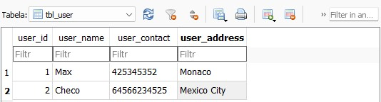

# Lab 7


### Tworzenie bazy danych DB Browser


Dodanie rekordów do tabeli.



Wykorzystanie stworzonej bazy danych w DB Browser.

```js
const db = openDatabase({name: 'user_db.db', createFromLocation: 1});
```

### Home Screen


```js
import React, {useEffect} from 'react';
import {View, Text, SafeAreaView, StyleSheet} from 'react-native';
import Mybutton from './components/Mybutton';
import Mytext from './components/Mytext';
import {openDatabase} from 'react-native-sqlite-storage';

var db = openDatabase({name: 'UserDatabase.db'});

const HomeScreen = ({navigation}) => {
  useEffect(() => {
    db.transaction(function (txn) {
      txn.executeSql(
        "SELECT name FROM sqlite_master WHERE type='table' AND name='table_user'",
        [],
        function (tx, res) {
          console.log('item:', res.rows.length);
          if (res.rows.length == 0) {
            txn.executeSql('DROP TABLE IF EXISTS table_user', []);
            txn.executeSql(
              'CREATE TABLE IF NOT EXISTS table_user(user_id INTEGER PRIMARY KEY AUTOINCREMENT, user_name VARCHAR(20), user_contact INT(10), user_address VARCHAR(255))',
              [],
            );
          }
        },
      );
    });
  }, []);

  return (
    <SafeAreaView style={{flex: 1}}>
      <View style={{flex: 1, backgroundColor: 'white'}}>
        <View style={{flex: 1}}>
          <Mytext text="Baza SQLite tworzona w czasie uruchomienia aplikacji" />
          <Mybutton
            title="Register"
            customClick={() => navigation.navigate('Register')}
          />
          <Mybutton
            title="Update"
            customClick={() => navigation.navigate('Update')}
          />
          <Mybutton
            title="View"
            customClick={() => navigation.navigate('View')}
          />
          <Mybutton
            title="View All"
            customClick={() => navigation.navigate('ViewAll')}
          />
          <Mybutton
            title="Delete"
            customClick={() => navigation.navigate('Delete')}
          />
        </View>
      </View>
    </SafeAreaView>
  );
};
```

### Wprowadzenie danych


```js
var db = openDatabase({name: 'UserDatabase.db'});

const RegisterUser = ({navigation}) => {
  let [userName, setUserName] = useState('');
  let [userContact, setUserContact] = useState('');
  let [userAddress, setUserAddress] = useState('');

  let register_user = () => {
    console.log(userName, userContact, userAddress);

    if (!userName) {
      alert('Please fill name');
      return;
    }
    if (!userContact) {
      alert('Please fill Contact Number');
      return;
    }
    if (!userAddress) {
      alert('Please fill Address');
      return;
    }

    db.transaction(function (tx) {
      tx.executeSql(
        'INSERT INTO table_user (user_name, user_contact, user_address) VALUES (?,?,?)',
        [userName, userContact, userAddress],
        (tx, results) => {
          console.log('Results', results.rowsAffected);
          if (results.rowsAffected > 0) {
            Alert.alert(
              'Success',
              'You are Registered Successfully',
              [
                {
                  text: 'Ok',
                  onPress: () => navigation.navigate('HomeScreen'),
                },
              ],
              {cancelable: false},
            );
          } else alert('Registration Failed');
        },
      );
    });
  };

  return (
    <SafeAreaView style={{flex: 1}}>
      <View style={{flex: 1, backgroundColor: 'white'}}>
        <View style={{flex: 1}}>
          <ScrollView keyboardShouldPersistTaps="handled">
            <KeyboardAvoidingView
              behavior="padding"
              style={{flex: 1, justifyContent: 'space-between'}}>
              <Mytextinput
                placeholder="Enter Name"
                onChangeText={(userName) => setUserName(userName)}
                style={{padding: 10}}
              />
              <Mytextinput
                placeholder="Enter Contact No"
                onChangeText={(userContact) => setUserContact(userContact)}
                maxLength={10}
                keyboardType="numeric"
                style={{padding: 10}}
              />
              <Mytextinput
                placeholder="Enter Address"
                onChangeText={(userAddress) => setUserAddress(userName)}
                maxLength={225}
                numberOfLines={5}
                multiline={true}
                style={{textAlignVertical: 'top', padding: 10}}
              />
              <Mybutton title="Submit" customClick={register_user} />
            </KeyboardAvoidingView>
          </ScrollView>
        </View>
      </View>
    </SafeAreaView>
  );
};
```

### Aktualizowanie danych


```js
import React, {useState} from 'react';
import {
  View,
  ScrollView,
  KeyboardAvoidingView,
  Alert,
  SafeAreaView,
  Text,
} from 'react-native';
import Mytextinput from './components/Mytextinput';
import Mybutton from './components/Mybutton';
import {openDatabase} from 'react-native-sqlite-storage';

var db = openDatabase({name: 'UserDatabase.db'});

const UpdateUser = ({navigation}) => {
  let [inputUserId, setInputUserId] = useState('');
  let [userName, setUserName] = useState('');
  let [userContact, setUserContact] = useState('');
  let [userAddress, setUserAddress] = useState('');

  let updateAllStates = (name, contact, address) => {
    setUserName(name);
    setUserContact(contact);
    setUserAddress(address);
  };

  let searchUser = () => {
    console.log(inputUserId);
    db.transaction((tx) => {
      tx.executeSql(
        'SELECT * FROM table_user where user_id = ?',
        [inputUserId],
        (tx, results) => {
          var len = results.rows.length;
          if (len > 0) {
            let res = results.rows.item(0);
            updateAllStates(res.user_name, res.user_contact, res.user_address);
          } else {
            alert('No user found');
            updateAllStates('', '', '');
          }
        },
      );
    });
  };
  let updateUser = () => {
    console.log(inputUserId, userName, userContact, userAddress);

    if (!inputUserId) {
      alert('Please fill User id');
      return;
    }
    if (!userName) {
      alert('Please fill name');
      return;
    }
    if (!userContact) {
      alert('Please fill Contact Number');
      return;
    }
    if (!userAddress) {
      alert('Please fill Address');
      return;
    }

    db.transaction((tx) => {
      tx.executeSql(
        'UPDATE table_user set user_name=?, user_contact=? , user_address=? where user_id=?',
        [userName, userContact, userAddress, inputUserId],
        (tx, results) => {
          console.log('Results', results.rowsAffected);
          if (results.rowsAffected > 0) {
            Alert.alert(
              'Success',
              'User updated successfully',
              [
                {
                  text: 'Ok',
                  onPress: () => navigation.navigate('HomeScreen'),
                },
              ],
              {cancelable: false},
            );
          } else alert('Updation Failed');
        },
      );
    });
  };

  return (
    <SafeAreaView style={{flex: 1}}>
      <View style={{flex: 1, backgroundColor: 'white'}}>
        <View style={{flex: 1}}>
          <ScrollView keyboardShouldPersistTaps="handled">
            <KeyboardAvoidingView
              behavior="padding"
              style={{flex: 1, justifyContent: 'space-between'}}>
              <Mytextinput
                placeholder="Enter User Id"
                style={{padding: 10}}
                onChangeText={(inputUserId) => setInputUserId(inputUserId)}
              />
              <Mybutton title="Search User" customClick={searchUser} />
              <Mytextinput
                placeholder="Enter Name"
                value={userName}
                style={{padding: 10}}
                onChangeText={(userName) => setUserName(userName)}
              />
              <Mytextinput
                placeholder="Enter Contact No"
                value={'' + userContact}
                onChangeText={(userContact) => setUserContact(userContact)}
                maxLength={10}
                style={{padding: 10}}
                keyboardType="numeric"
              />
              <Mytextinput
                value={userAddress}
                placeholder="Enter Address"
                onChangeText={(userAddress) => setUserAddress(userAddress)}
                maxLength={225}
                numberOfLines={5}
                multiline={true}
                style={{textAlignVertical: 'top', padding: 10}}
              />
              <Mybutton title="Update User" customClick={updateUser} />
            </KeyboardAvoidingView>
          </ScrollView>
        </View>
      </View>
    </SafeAreaView>
  );
};
```

### Wyszukanie


```js
var db = openDatabase({name: 'UserDatabase.db'});

const ViewUser = () => {
  let [inputUserId, setInputUserId] = useState('');
  let [userData, setUserData] = useState({});

  let searchUser = () => {
    console.log(inputUserId);
    setUserData({});
    db.transaction((tx) => {
      tx.executeSql(
        'SELECT * FROM table_user where user_id = ?',
        [inputUserId],
        (tx, results) => {
          var len = results.rows.length;
          console.log('len', len);
          if (len > 0) {
            setUserData(results.rows.item(0));
          } else {
            alert('No user found');
          }
        },
      );
    });
  };

  return (
    <SafeAreaView style={{flex: 1}}>
      <View style={{flex: 1, backgroundColor: 'white'}}>
        <View style={{flex: 1}}>
          <Mytextinput
            placeholder="Enter User Id"
            onChangeText={(inputUserId) => setInputUserId(inputUserId)}
            style={{padding: 10}}
          />
          <Mybutton title="Search User" customClick={searchUser} />
          <View style={{marginLeft: 35, marginRight: 35, marginTop: 10}}>
            <Text>User Id: {userData.user_id}</Text>
            <Text>User Name: {userData.user_name}</Text>
            <Text>User Contact: {userData.user_contact}</Text>
            <Text>User Address: {userData.user_address}</Text>
          </View>
        </View>
      </View>
    </SafeAreaView>
  );
};
```

### Wyświetlenie wszystkiego


```js
var db = openDatabase({ name: 'UserDatabase.db' });

const ViewAllUser = () => {
    let [flatListItems, setFlatListItems] = useState([]);

    useEffect(() => {
        db.transaction((tx) => {
            tx.executeSql('SELECT * FROM table_user', [], (tx, results) => {
                var temp = [];
                for (let i = 0; i < results.rows.length; ++i)
                    temp.push(results.rows.item(i));
                setFlatListItems(temp);
            });
        });
    }, []);

    let listViewItemSeparator = () => {
        return (
            <View
                style={{ height: 0.2, width: '100%', backgroundColor: '#808080' }}
            />
        );
    };

    let listItemView = (item) => {
        return (
            <View
                key={item.user_id}
                style={{ backgroundColor: 'white', padding: 20 }}>
                <Text>Id: {item.user_id}</Text>
                <Text>Name: {item.user_name}</Text>
                <Text>Contact: {item.user_contact}</Text>
                <Text>Address: {item.user_address}</Text>
            </View>
        );
    };

    return (
        <SafeAreaView style={{ flex: 1 }}>
            <View style={{ flex: 1, backgroundColor: 'white' }}>
                <View style={{ flex: 1 }}>
                    <FlatList
                        data={flatListItems}
                        ItemSeparatorComponent={listViewItemSeparator}
                        keyExtractor={(item, index) => index.toString()}
                        renderItem={({ item }) => listItemView(item)}
                    />
                </View>
            </View>
        </SafeAreaView>
    );
};
```

### Usunięcie rekordu


```js
import React, {useState} from 'react';
import {Text, View, Alert, SafeAreaView} from 'react-native';
import Mytextinput from './components/Mytextinput';
import Mybutton from './components/Mybutton';
import {openDatabase} from 'react-native-sqlite-storage';

var db = openDatabase({name: 'UserDatabase.db'});

const DeleteUser = ({navigation}) => {
  let [inputUserId, setInputUserId] = useState('');

  let deleteUser = () => {
    db.transaction((tx) => {
      tx.executeSql(
        'DELETE FROM  table_user where user_id=?',
        [inputUserId],
        (tx, results) => {
          console.log('Results', results.rowsAffected);
          if (results.rowsAffected > 0) {
            Alert.alert(
              'Success',
              'User deleted successfully',
              [
                {
                  text: 'Ok',
                  onPress: () => navigation.navigate('HomeScreen'),
                },
              ],
              {cancelable: false},
            );
          } else {
            alert('Please insert a valid User Id');
          }
        },
      );
    });
  };

  return (
    <SafeAreaView style={{flex: 1}}>
      <View style={{flex: 1, backgroundColor: 'white'}}>
        <View style={{flex: 1}}>
          <Mytextinput
            placeholder="Enter User Id"
            onChangeText={(inputUserId) => setInputUserId(inputUserId)}
            style={{padding: 10}}
          />
          <Mybutton title="Delete User" customClick={deleteUser} />
        </View>
      </View>
    </SafeAreaView>
  );
};
```


